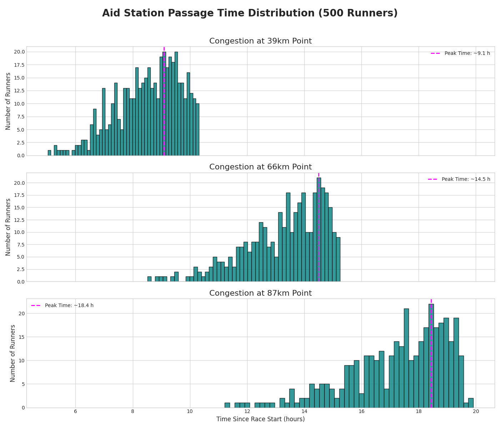

# **Trail Running Race Congestion Simulator**

[Japanese/日本語](README_JA.md)

## **Overview**

This project provides a suite of Python scripts to simulate and analyze runner congestion in trail running races using GPX course data and the Monte Carlo method.

A key feature is its ability to model congestion on narrow single-track sections where overtaking is difficult, aiming for more realistic predictions. The primary goal is to assist race directors and organizers in making informed decisions by evaluating how factors like participant numbers and start times might affect the race, and by helping to plan resource allocation for aid stations.

### Samples

#### The grpah of the runner distribution snapshot 


#### The grpah of the aid station congestion



#### The gif of the dot animation on the map


## **Disclaimer**

This simulator is based on simplified physical models and statistical assumptions. Therefore, the simulation results should be considered as **approximations** and are not intended to be a perfect or exact representation of real-world race conditions.

Many unpredictable factors not modeled in this simulation can affect an actual race, including weather, trail conditions, individual runner's physical condition, equipment issues, and DNFs. The creator of this tool assumes no responsibility for any damages or losses resulting from its use.

## **Key Features**

* Extracts course information (distance, elevation, gradient) from GPX files.  
* Implements a Monte Carlo simulation where each runner's pace is based on a normal distribution.  
* Features a congestion model based on course capacity (e.g., for single tracks).  
* Visualizes the overall runner distribution at specific times with "Snapshot Analysis".  
* Analyzes passage times at specific points (e.g., aid stations) to visualize congestion peaks with "Checkpoint Analysis".

## **Setup**

### **Prerequisites**

To run these scripts, you will need the following Python libraries:

* gpxpy  
* pandas  
* numpy  
* matplotlib

You can install them all with a single command:

```shell
pip install gpxpy pandas numpy matplotlib
```

## **How to Use**

The workflow consists of four main steps, using the scripts in sequence:

[GPX File] -> (1. gpx_parser.py) -> [Course CSV] -> (2. single_track_simulation.py) -> [Simulation Result CSV] -> (3. & 4. Analysis Scripts) -> [Analysis Graphs]

### **Step 1: Create Course Data CSV from a GPX File**

First, convert your race's GPX file into a CSV format that the other scripts can read.

**Command**

```shell
python src/gpx_parser.py [path/to/your/gpx_file.gpx] [options]
```

**Options**

*   `-o, --output`: Path to the output CSV file. If not provided, a default name will be generated (e.g., `your_gpx_file_course_data.csv`).

**Example**

```shell
python src/gpx_parser.py your_race.gpx -o my_course.csv

# Output  
A file named my_course.csv will be created.
```

### **Step 2 & 3: Run Simulation and Analysis**

All simulation and analysis parameters are managed through a single project JSON file.

**Project JSON File Structure**

The file consists of two main sections: `simulation` and `analysis`.

```json
{
  "simulation": {
    "settings": {
      "runners": 500,
      "avg_pace_min_per_km": 12,
      "std_dev_pace": 1.5,
      "time_limit_hours": 26
    },
    "wave_start": {
      "groups": 3,
      "interval_minutes": 10
    },
    "cutoffs": [
      {"distance_km": 39, "time_hours": 10},
      {"distance_km": 66, "time_hours": 15}
    ],
    "single_track_sections": [
      {"range_km": [5, 8], "capacity": 2}
    ]
  },
  "analysis": {
    "runner_distribution": {
      "snapshot_times_hours": [5, 10, 15, 20],
      "output_filename": "runner_distribution_snapshot.png"
    },
    "aid_station": {
      "stations_km": [39, 66],
      "output_filename": "aid_station_congestion.png"
    },
    "dot_animation": {
      "output_filename": "dot_animation.html",
      "time_step_minutes": 15,
      "max_runners_to_display": 500
    }
  }
}
```

**Execution Workflow**

1.  **Run the Simulation**
    ```shell
    python src/single_track_simulation.py [course.csv] [project.json] -o [simulation_results.csv]
    ```
2.  **Run the Analyses**
    ```shell
    # Runner Distribution
    python src/runner_distribution_analysis.py [simulation_results.csv] [course.csv] [project.json]
    
    # Aid Station Congestion
    python src/aid_station_analysis.py [simulation_results.csv] [project.json]
    
    # Dot Animation
    python src/create_dot_animation.py [simulation_results.csv] [course.csv] [project.json]
    ```

**Example**

```shell
# 1. Create course data
python src/gpx_parser.py your_race.gpx -o my_course.csv

# 2. Run the simulation
python src/single_track_simulation.py my_course.csv project_params.json -o my_simulation.csv

# 3. Run all analyses
python src/runner_distribution_analysis.py my_simulation.csv my_course.csv project_params.json
python src/aid_station_analysis.py my_simulation.csv project_params.json
python src/create_dot_animation.py my_simulation.csv my_course.csv project_params.json

# Output
Each analysis result will be saved with the filename specified in the `analysis` section of project_params.json.
```

## **License**

This project is released under the [MIT License](https://www.google.com/search?q=LICENSE).
