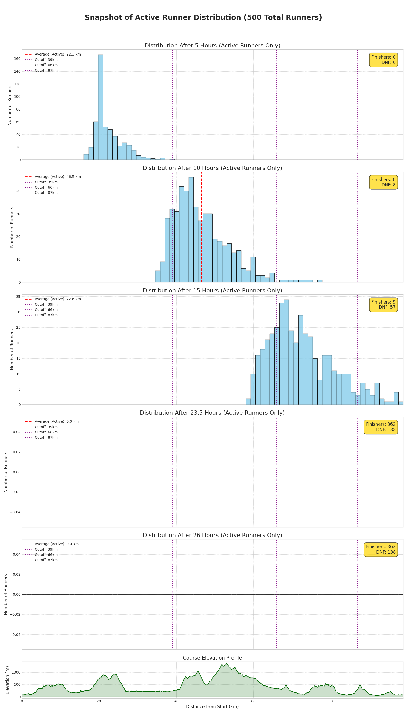
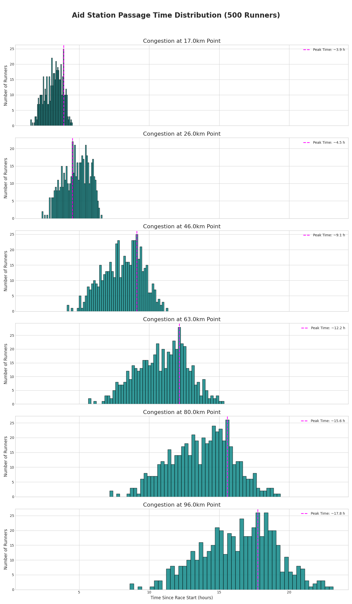

# **トレイルランニングレース渋滞シミュレーター**

## **概要**

このプロジェクトは、GPXコースデータとモンテカルロ法を用いて、トレイルランニングレースにおけるランナーの渋滞をシミュレーション・分析するための一連のPythonスクリプトです。

追い越しが困難な狭いシングルトラック区間での渋滞をモデル化することで、より現実的な予測を目指す点が特徴です。主な目的は、参加者数やスタート時間などの要因がレースに与える影響を評価し、エイドステーションのリソース配分計画を支援することで、レースディレクターや主催者が情報に基づいた意思決定を行えるようにすることです。

### サンプル

#### ランナー分布のスナップショットグラフ



#### エイドステーションの渋滞グラフ



## **免責事項**

このシミュレーターは、簡略化された物理モデルと統計的な仮定に基づいています。そのため、シミュレーション結果は**近似値**として捉えるべきであり、実際のレースコンディションを完全または正確に表現するものではありません。

天候、トレイルの状態、個々のランナーの体調、装備の問題、DNF（途中棄権）など、このシミュレーションではモデル化されていない多くの予測不可能な要因が実際のレースに影響を与える可能性があります。このツールの使用によって生じたいかなる損害や損失についても、作成者は一切の責任を負いません。

## **主な機能**

*   GPXファイルからコース情報（距離、標高、勾配）を抽出します。
*   各ランナーのペースが正規分布に従うモンテカルロシミュレーションを実装しています。
*   コースのキャパシティ（例：シングルトラック）に基づいた渋滞モデルを特徴としています。
*   「スナップショット分析」により、特定の時刻における全体のランナー分布を可視化します。
*   「チェックポイント分析」により、特定の地点（例：エイドステーション）での通過時間を分析し、渋滞のピークを可視化します。

## **セットアップ**

### **前提条件**

これらのスクリプトを実行するには、以下のPythonライブラリが必要です。

*   gpxpy
*   pandas
*   numpy
*   matplotlib

以下のコマンドで、これらすべてを一度にインストールできます。

```shell
pip install gpxpy pandas numpy matplotlib
```

## **使用方法**

ワークフローは、スクリプトを順番に使用する4つの主要なステップで構成されます。

[GPXファイル] -> (1. gpx_parser.py) -> [コースCSV] -> (2. single_track_simulation.py) -> [シミュレーション結果CSV] -> (3. & 4. 分析スクリプト) -> [分析グラフ]

### **ステップ1：GPXファイルからコースデータCSVを作成する**

まず、レースのGPXファイルを、他のスクリプトが読み取れるCSV形式に変換します。

**コマンド**

```shell
python gpx_parser.py [path/to/your/gpx_file.gpx]
```

**実行例**

```shell
python gpx_parser.py your_race.gpx

# 出力
your_race_course_data.csv という名前のファイルが作成されます。
```

### **ステップ2：渋滞シミュレーションを実行する**

次に、ステップ1で作成したコースデータCSVを使用して、メインのシミュレーションを実行します。

準備（任意）
実行前に、`single_track_simulation.py`を編集して、実際のレースコースに合わせたシングルトラック区間を定義できます。

```python
# 実際のレースコースに合わせてこれらの定義をカスタマイズしてください
single_track_definitions = [
    {'range_km': (5, 8), 'capacity': 2},    # 5kmから8kmまで、キャパシティは2人
    {'range_km': (20, 22.5), 'capacity': 1}, # 20kmから22.5kmまで、キャパシティは1人
]
```

**コマンド**

```shell
python single_track_simulation.py [course_data.csv] [options]
```

**オプション**

*   -n, --runners: ランナーの数（デフォルト：500）
*   -p, --avg_pace: 平均ペース（分/km）（デフォルト：10.0）
*   -s, --std_dev: ペースの標準偏差（デフォルト：1.5）
*   -t, --time_limit: 制限時間（時間）（デフォルト：24）
*   --wave_groups: ウェーブスタートのグループ数（デフォルト：1、一斉スタートの場合）
*   --wave_interval: ウェーブ間のスタート間隔（分）（デフォルト：0）

**実行例（1500人のランナー、平均ペース12分/kmのレースをシミュレーションする場合）**

```shell
python single_track_simulation.py your_race_course_data.csv --runners 1500 --avg_pace 12.0

# 出力
congestion_sim_results_1500runners.csv のようなCSVファイルが生成されます。
```

### **ステップ3：シミュレーション結果を分析する**

ステップ2で生成されたデータを2つの分析スクリプトで可視化します。

#### **ランナー分布スナップショット分析**

このスクリプトは、特定の瞬間にランナーがコース上のどこに分布しているかを示します。

**コマンド**

```shell
python runner_distribution_analysis.py [simulation_results.csv] [course_data.csv] [options]
```

**オプション**

*   -t, --times: スナップショットの時刻を時間単位で、スペース区切りで指定します。（デフォルト：3 10）

**実行例（レース開始後15時間と20時間の分布を分析する場合）**

```shell
python runner_distribution_analysis.py congestion_sim_results_1500runners.csv your_race_course_data.csv --times 15 20

# 出力
runner_distribution_snapshot_1500runners_active.png のような画像ファイルが作成されます。
```

#### **エイドステーション渋滞分析**

このスクリプトは、特定の場所（チェックポイントやエイドステーション）での渋滞のピーク時間を分析します。

**コマンド**

```shell
python aid_station_analysis.py [simulation_results.csv] [options]
```

**オプション**

*   -s, --stations: チェックポイントの距離をkm単位で、スペース区切りで指定します。（デフォルト：25 50 75 95）
*   -o, --output: 出力ファイル名を指定します。（デフォルト：aid_station_congestion.png）

**実行例（30km、60km、90km地点の渋滞を分析する場合）**

```shell
python aid_station_analysis.py congestion_sim_results_1500runners.csv --stations 30 60 90

# 出力
aid_station_congestion.png のようなグラフ画像が作成されます。
```

## **ライセンス**

このプロジェクトは[MITライセンス](https://www.google.com/search?q=LICENSE)の下で公開されています。
